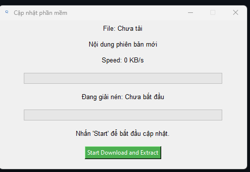

`Updater` sẽ sử dụng api để kiểm tra và tải thư mục đã nén từ `server` về thư mục của phần mềm đang hoạt động.  



Ví dụ về tệp tin nén cần tải từ server, các file có sự thay đổi sẽ nén lại vào 1 tệp.  


Các thông tin cần thiết cung cấp cho `Updater` sẽ là 1 file json nằm ở thư mục `data/config.json` với nội dung:  

```
"Update_app": {  
        "server": "http://192.168.0.100:8000",  
        "api_get_version": "http://192.168.0.100:8000/update/latest-version",  
        "main_app_name": "SmartParking.exe",  
        "update_zip_name": "app_update.zip",  
        "current_version": "1.0.0"  
    }  
```

`api_get_version`: là địa chỉ api dùng để kiểm tra version từ server và sẽ trả về 1 file json chứa các nội dung sau:  

```
{
    "latest_version": "1.1.3",
    "download_url": "http://192.168.0.100:8000/update/download/1.1.3",
    "release_notes": "Cập nhật tính năng mới và sửa lỗi.",
    "checksum": "56cd622eb0fe19cf297500c8de65909f9f85df3a4e46587aff4b858a07a39a14"
}
```

`latest_version`: sẽ là phiên bản version mới nhất từ server  
`download_url`: là địa chỉ api dùng để tải file zip (app.exe, các tệp và thư mục có sự thay đổi như thêm, bớt, xóa) về  
`release_notes`: là nội dung thay đổi của phiên bản mới  
`checksum`: là checksum của tệp zip đã nén ở server, để sau khi tải file zip về thì sẽ so sánh checksum tệp vừa tải và tệp từ server có trùng nhau không, nếu trùng nhau thì tức là tệp zip tải về và tệp zip từ server là nguyên vẹn, còn khác nhau thì có thể trong quá trình tải về tệp zip xảy ra lỗi (không còn nguyên vẹn như lúc ở server)  

`main_app_name`: là tên phần mềm sẽ được khởi chạy sau khi hoàn tất cập nhật  

`update_zip_name`: Tên của tệp zip được sử dụng để lưu tạm thời tệp từ server, tải về xong sẽ tự xóa  

`current_version`: là phiên bản hiện tại mà `main_app_name` đang sử dụng, sau khi cập nhật nó sẽ tự động cập nhật phiên bản mới vào file này  

LƯU Ý: CHƯƠNG TRÌNH CHÍNH (MAIN_APP_NAME) VÀ CHƯƠNG TRÌNH CẬP NHẬT (UPDATER) PHẢI NẰM CÙNG THƯ MỤC  


Như ví dụ này thì phần mềm `Updater` sẽ chịu trách nhiệm cập nhật phần mềm cho phần mềm `smartparking`  
Đoạn code dưới đây được gọi từ chương trình chính, nó sẽ chạy một luồng riêng, để không ảnh hưởng đến luồng chính của phần mềm `smartparking`  

```
# Thêm luồng kiểm tra cập nhật
self.App_DIR = os.getcwd()
update_thread = threading.Thread(target=self.check_for_updates, args=(current_version,), daemon=True)  # Kiểm tra xem có bản cập nhật không
update_thread.start()

def check_for_updates(self, current_version):
    """
    Kiểm tra cập nhật từ API. Nếu có bản cập nhật, khởi chạy updater và đóng ứng dụng.
    """
    latest_version_info = get_latest_version_info()
    if latest_version_info:
        latest_version = latest_version_info['latest_version']
        if version.parse(latest_version) > version.parse(current_version):
            # Hiển thị lời nhắc cho người dùng
            response = messagebox.askyesno("Cập Nhật", f"Phiên bản mới ({latest_version}) đã có.\nVui lòng tiến hành cập nhật phần mềm?")
            if response:
                self.launch_updater()
            else:
                logger.error("Người dùng không cập nhật phần mềm")
                self.on_closing()

def launch_updater(self):
    """
    Khởi chạy updater.exe và đóng ứng dụng chính.
    """
    updater_path = os.path.join(self.App_DIR, "Updater.exe")  # Đảm bảo updater.exe nằm cùng thư mục với app.exe
    # print(updater_path) # D:\Project\Smart_Parking_Sensor\updater.exe
    if os.path.exists(updater_path):
        self.on_closing()

        # Mở chạy phần mềm cập nhật
        subprocess.Popen([updater_path])
        
    else:
        messagebox.showerror("Lỗi", "Không tìm thấy Updater, vui lòng liên hệ bộ phận IT để cập nhật phần mềm.")
```