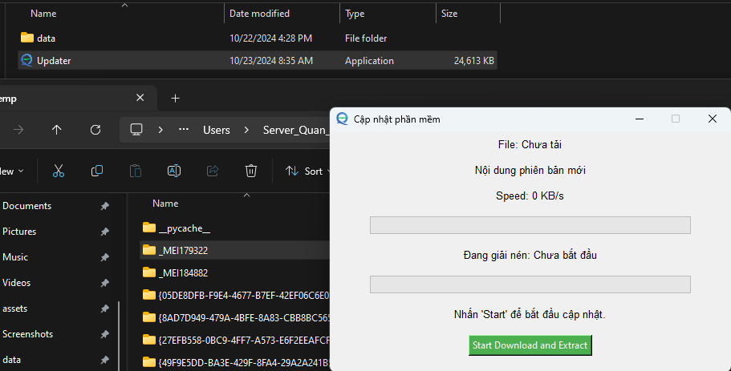

# Đóng gói ứng dụng từ file py thành EXE

Để đóng gói `python` thành một ứng dụng `exe` ta có thể sử dụng `auto py to exe`. Tìm hiểu thêm tại [Trang chủ](https://github.com/brentvollebregt/auto-py-to-exe).  
Cài đặt thư viện bằng cách chạy lệnh sau:  
```python
pip install auto-py-to-exe
```
Sau khi cài đặt thư viện thì tiến hành khởi chạy ứng dụng bằng câu lệnh:  
```python
auto-py-to-exe
```
Đây là giao diện của `auto-py-to-exe`  


Tiếp theo ta sẽ chọn các thông tin cần thiết để cung cấp cho phần mềm:  
`Script Location`: Là tệp tin chính của chúng ta, thường sẽ là `main.py`  
`Onefile`: Nên chọn chế độ `onefile` để nó đóng gói thành 1 tệp exe  
`Console window`: Chọn `Window Based` để ẩn đi cửa sổ `console` nếu phần mềm của mình đã có giao diện  
`Icon`: Đường dẫn đến hình ảnh icon của phần mềm, lưu ý phải là file đuôi `ICO`  
`Additional File`: Thêm các file cần thiết cho phần mềm như `hình ảnh`, tệp `json`, thường là các tệp tin không thay đổi nhiều trong phần mềm.  


## Lưu ý trong việc Additional Files

Trong chương trình này, chúng ta sử dụng các file: `data\\config.json`, `data\\log.txt `, `assets\\image\\Update_ico.ico `  

```python
json_filename = "data\\config.json"
txt_log = "data\\log.txt"
self.root.iconbitmap("assets\\image\\Update_ico.ico")

```

Khi đóng gói phần mềm bằng `pyinstall` và khởi chạy phần mềm thì chương trình của chúng ta không chạy ở thư mục chứa file `exe`, mà nó sẽ tạo ra 1 thư mục tạm có tên `_MEIxxxx` và chạy ở đấy.  



Từ ảnh trên có thể thấy, thư mục chứa tệp `exe` là nằm ở `Program File (x86)` nhưng khi chạy thì thư mục thực sự đang chứa các tệp tài nguyên cần thiết cho phần mềm là `_MEI179322 nằm ở: C:\Users\Server_Quan_IT\AppData\Local\Temp\_MEI179322`  


Vì vậy để phần mềm có thể tìm đến các tài nguyên một cách chính xác ta cần thêm hàm sau, hàm này sẽ lấy địa chỉ đang chạy của chương trình một cách chính xác, khi chạy bằng tệp python hoặc khi chạy bằng exe được đóng gói bằng pyinstall:  

```python
def resource_path(relative_path):
    """ Trả về đường dẫn đến file tài nguyên khi đóng gói với PyInstaller """
    try:
        # Khi chạy ứng dụng từ file .exe
        base_path = sys._MEIPASS
    except Exception:
        # Khi chạy từ mã nguồn Python
        base_path = os.path.abspath(".")
    return os.path.join(base_path, relative_path)
```
Sau đó ta thay thế các đoạn mã sử dụng tài nguyên bằng cách sử dụng hàm `resource_path` như sau:  

```python
json_filename = resource_path("data\\config.json")
txt_log = resource_path("data\\log.txt")
self.root.iconbitmap(resource_path("assets\\image\\Update_ico.ico"))
```
Và cách thêm các tài nguyên để đóng gói vào `auto-py-to-exe` như sau:


Chương trình của tôi dùng 3 file, và 3 file đó có đường dẫn như sau: `data\\my_file1`, `data\\my_file2`, `assets\\image\\my_file3`  
Vì vậy khi ta chọn chức năng `Add Folder` thì ta sẽ chọn folder chứa các tài nguyên của chúng ta là `data`, và `image` thì nó sẽ tự động lấy hết các tệp tin bên trong thư mục đó (vì vậy chỉ bỏ vào các tệp tin cần thiết, nếu không nó sẽ copy hết các file và gây ra dư thừa và nặng chương trình sau khi đóng gói) và ô kế bên đó phải điền đúng đường dẫn khi ta sử dụng, nếu không sẽ lỗi. Vì vậy ta sẽ điền tương ứng là `assets/image` và `data/` nó sẽ tự tạo 2 thư mục đó và đưa các file cần thiết vào đúng 2 thư mục đó.  

`Advance`: Thường đây sẽ là nơi nhập tên của phần mềm và các thư viện mà đã sử dụng bằng `hidden-import`  


`Setting`: Chủ yếu dùng để xuất file json hoặc nhập file json cho các lần sau sử dụng lại, không cần điền lại các thông số từ đầu.  


Sau khi cấu hình hoàn tất thì chọn `Export Config to JSON File` để lưu file này lại cho các lần sử dụng sau.  

Sau đó `import` tệp json đã được chuẩn bị sẵn [tại đây](data/auto-py-to-exe-updater.json). Lưu ý đường dẫn đến các tệp có thể đang bị sai, thay đổi cho phù hợp với thực tế.  


Sau khi hoàn thành thì vào thư mục `output` tương ứng sẽ thấy một tệp exe, chỉ cần chạy tệp này là được, Nếu chương trình của bạn có các thư mục thay đổi hằng ngày thì có thể bỏ nó vào vị trí tương ứng với vị trí đặt phần mềm.  


# Một số lưu ý:  

## 0. Không thêm tệp vào exe
Có một số trường hợp ta không nên sử dụng `Additional Files`:  
Chúng ta có 1 tệp `json` chứa các thiết lập ban đầu như `địa chỉ api`, ` tên phần mềm`, ... đây là những thông số có thể thay đổi thường xuyên, vì vậy ta không thêm nó trực tiếp vào exe, mà để nớ ở cùng thư mục exe để nó dễ dàng truy cập và ta cũng dễ dàng chỉnh sửa tệp này.  
Khi đó ta sẽ không sử dụng hàm `resource_path` để đọc tệp tin mà sẽ đọc trực tiếp, còn các file khác mà cần thì vẫn đọc bằng `resoucer_path` như bình thường và `phair thêm vào additon file`:  

```python
json_filename = "data\\config.json"
txt_log = "data\\log.txt"
self.root.iconbitmap("assets\\image\\Update_ico.ico")
```
Sau khi có file exe thì ta copy 2 thư mục này vào cùng vị trí với exe. Để nó có thể tìm được các tệp này.  


## 1. Lỗi nhận diện nhầm virus
`Window defender` có thể nhận nhầm đây là 1 phần mềm có chứa `virus` nên khi tạo thành file exe thì ngay lập tức bị xóa, vì vậy khi nó hiển thị thông báo phát hiện virus thì nhanh chóng ấn vào đó và cho phép nó chạy, thì file exe sẽ không bị xóa.  

## 2. Thiếu thư viện  
Nếu sau khi có exe và chạy, nó báo lỗi `không tìm thấy module xxx` thì có nghĩa là đang không tìm thấy thư viện `xxx`, cần import nó vào mục `Advanced/hidden import`  


## Một số lỗi khác 

Xem thêm một số lỗi khác tại [trang chủ](https://nitratine.net/blog/post/issues-when-using-auto-py-to-exe/#debugging)