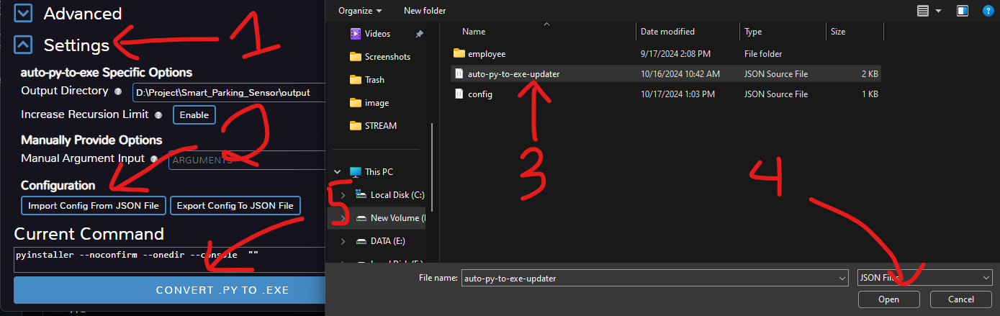

# Đóng gói ứng dụng từ file py thành EXE

Để đóng gói python thành một ứng dụng `exe` ta có thể sử dụng `auto py to exe`. Tìm hiểu thêm tại [Trang chủ](https://github.com/brentvollebregt/auto-py-to-exe).  
Cài đặt thư viện bằng cách chạy lệnh sau:  
```
pip install auto-py-to-exe
```
Sau khi cài đặt thư viện thì tiến hành khởi chạy ứng dụng bằng câu lệnh:  
```
auto-py-to-exe
```


Sau đó `import` tệp json đã được chuẩn bị sẵn [tại đây](data/auto-py-to-exe-updater.json)  



# Một số lưu ý:  

## 1. Lỗi nhận diện nhầm virus
`Window defender` có thể nhận nhầm đây là 1 phần mềm có chứa `virus` nên khi tạo thành file exe thì ngay lập tức bị xóa, vì vậy khi nó hiển thị thông báo phát hiện virus thì nhanh chóng ấn vào đó và cho phép nó chạy, thì file exe sẽ không bị xóa.  

## 2. Thiếu thư viện  
Nếu sau khi có exe và chạy, nó báo lỗi `không tìm thấy module xxx` thì có nghĩa là đang không tìm thấy thư viện `xxx`, cần import nó vào mục `Advanced/hidden import`  


```
<div class="modal fade" id="myModal" tabindex="-1" role="dialog" aria-labelledby="exampleModalLabel" aria-hidden="true" data-backdrop="static">

  <div class="modal-dialog" role="document">

    <div class="modal-content">

      <div class="modal-header">

        <h5 class="modal-title" id="exampleModalLabel">Tiêu đề hộp thoại</h5>

        <button type="button" class="close" data-dismiss="modal" aria-label="Close">

          <span aria-hidden="true">&times;</span>


        </button>

      </div>

      <div class="modal-body">

        Đây là nội dung của hộp thoại.

      </div>

      <div class="modal-footer">

        <button type="button" class="btn btn-secondary" data-dismiss="modal">Đóng</button>

        <button type="button" class="btn btn-primary">Lưu thay đổi</button>

      </div>

    </div>

  </div>

</div>
----------------
 <link href="https://stackpath.bootstrapcdn.com/bootstrap/4.5.2/css/bootstrap.min.css" rel="stylesheet">
------------
    <script src="https://code.jquery.com/jquery-3.5.1.slim.min.js"></script>

    <script src="https://cdn.jsdelivr.net/npm/@popperjs/core@2.9.1/dist/umd/popper.min.js"></script>

    <script src="https://stackpath.bootstrapcdn.com/bootstrap/4.5.2/js/bootstrap.min.js"></script>
------------------------------------
<asp:Button ID="btnShowModal" runat="server" CssClass="btn btn-primary" Text="Hiển thị hộp thoại" OnClientClick="$('#myModal').modal('show'); return false;" />
```